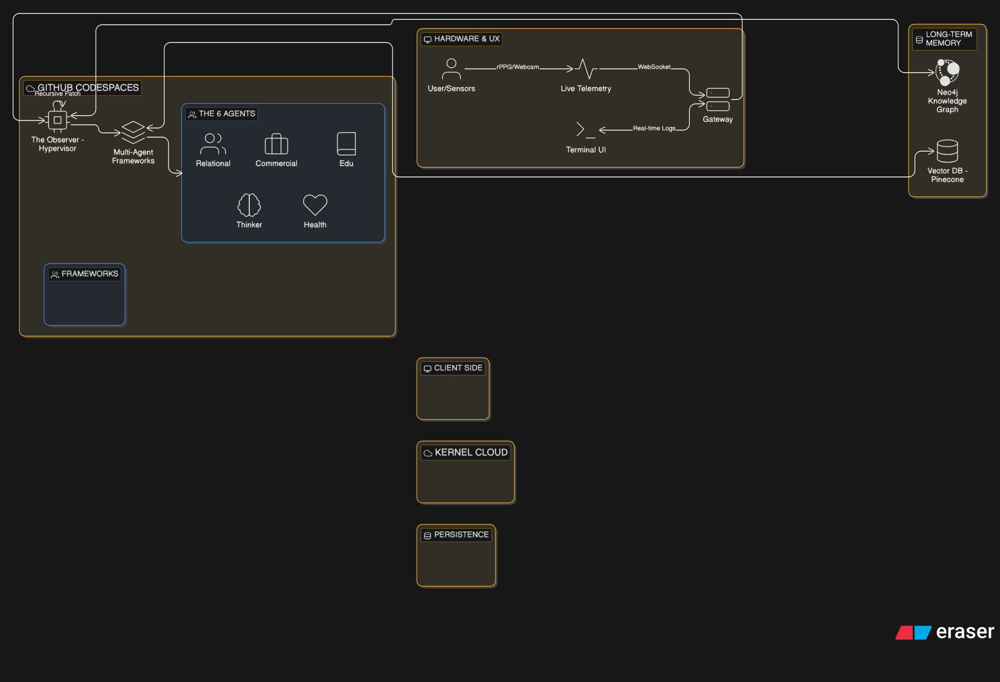

This `README.md` is designed to be a high-signal document. It frames your project not as a simple app, but as a **Cognitive Architecture**. This is exactly what a senior engineer or an AI recruiter in 2026 would look for.

---

# Neuro-Kernel: Personal AGI & Human-Optimization Architecture

**Neuro-Kernel** is a cybernetic human-operating system designed to replace "Legacy Software" (biological instincts and societal conditioning) with a **6-Layer Modular Framework**. By treating human life as a series of integrated workflows, the system minimizes "System Noise" and maximizes "Throughput" through **Active Inference** and **Recursive Self-Patching**.

---

## 🧠 The Thesis

Most human failure stems from **Cognitive Entropy**—the friction between conflicting internal goals (e.g., Health vs. Commerce) and external noise. The Neuro-Kernel utilizes a **Nested Brain** simulation environment to test decisions before execution, ensuring that the human "Hardware" and "Software" are always in sync.

---

## 🏗️ The 6-Layer Framework

| Layer | System Function | Objective |
| --- | --- | --- |
| **01. Cognitive** | Ingestion Engine | Converting raw data streams into a persistent **Neural Graph**. |
| **02. Relational** | Social Protocol | Filtering interpersonal noise and optimizing "External Node" interactions. |
| **03. Commercial** | Value API | Packaging internal intelligence into high-market-value output. |
| **04. Health** | Bio-Systemic Monitor | Hardware maintenance: Tracking energy, cortisol, and chemical baselines. |
| **05. Thinker** | Simulation Sandbox | Running "What-If" scenarios in a recursive world model (The Free Will layer). |
| **06. Observer** | Hypervisor (AGI) | The Master Process that monitors, weights, and patches the other five. |

---

## 🛠️ Technical Stack (2026 Standard)

* **Orchestration:** `LangGraph` (Stateful multi-agent workflows).
* **Reasoning Engine:** `Gemini 1.5 Pro` / `OpenAI o1` (The Observer) & `Llama 3.3` (Sub-frameworks).
* **Long-Term Memory:** `Neo4j` (Knowledge Graph) + `Weaviate` (Vector Storage).
* **Telemetry:** `Server-Sent Events (SSE)` for real-time log streaming to a React/Next.js UI.
* **Bio-Sensors:** `rPPG` (Webcam-based heart rate detection) + `Wearable API` integration.
* **Dev Environment:** `GitHub Codespaces` + `Docker`.

---

## 🔄 System Mechanics: The Active Inference Loop

The Neuro-Kernel does not just "predict"; it **reasons** by minimizing **Surprise (Free Energy)**.

1. **Sense:** Captures bio-metrics (Hardware) and environment data (Software).
2. **Simulate:** The **Thinker** runs 1,000 "rollouts" of a decision in the **Nested Brain**.
3. **Mediate:** The **Observer** resolves conflicts between framework proposals (e.g., Commercial ROI vs. Health Cost).
4. **Execute:** Optimized output is delivered to the user with zero wasted energy.
5. **Patch:** The **Observer** generates "Patch Notes" to rewrite system prompts for the next cycle.

---

