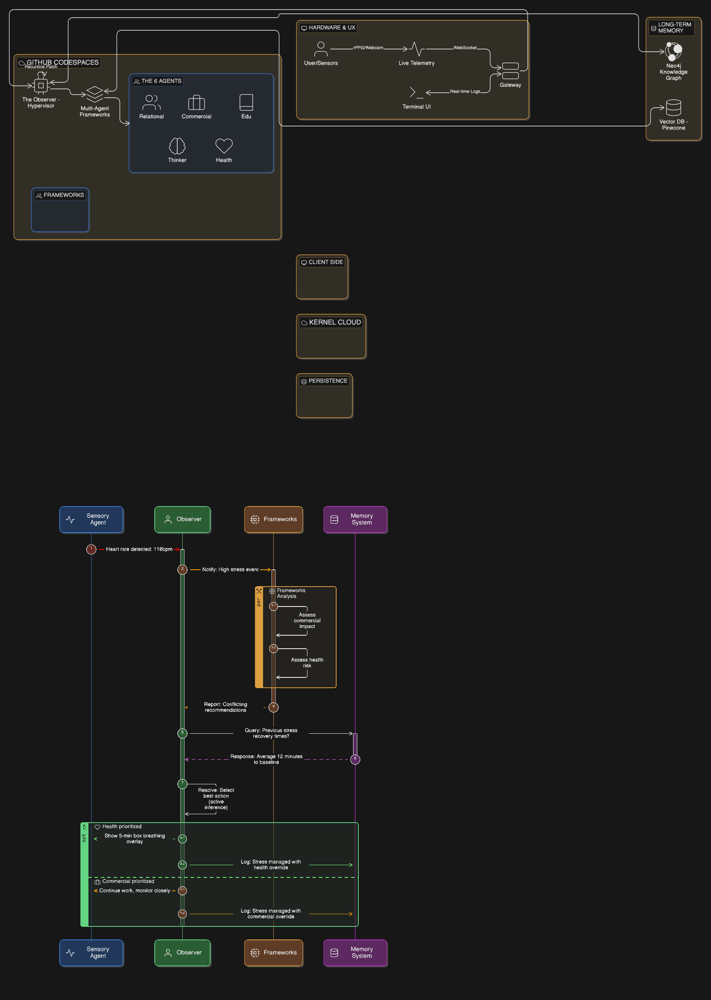

This `README.md` is designed to be a high-signal document. It frames your project not as a simple app, but as a **Cognitive Architecture**. This is exactly what a senior engineer or an AI recruiter in 2026 would look for.

---

# Neuro-Kernel: Personal AGI & Human-Optimization Architecture



**Neuro-Kernel** is a cybernetic human-operating system designed to replace "Legacy Software" (biological instincts and societal conditioning) with a **6-Layer Modular Framework**. By treating human life as a series of integrated workflows, the system minimizes "System Noise" and maximizes "Throughput" through **Active Inference** and **Recursive Self-Patching**.

---

## 🧠 The Thesis

Most human failure stems from **Cognitive Entropy**—the friction between conflicting internal goals (e.g., Health vs. Commerce) and external noise. The Neuro-Kernel utilizes a **Nested Brain** simulation environment to test decisions before execution, ensuring that the human "Hardware" and "Software" are always in sync.

---

## 🏗️ The 6-Layer Framework

| Layer | System Function | Objective |
| --- | --- | --- |
| **01. Cognitive** | Ingestion Engine | Converting raw data streams into a persistent **Neural Graph**. |
| **02. Relational** | Social Protocol | Filtering interpersonal noise and optimizing "External Node" interactions. |
| **03. Commercial** | Value API | Packaging internal intelligence into high-market-value output. |
| **04. Health** | Bio-Systemic Monitor | Hardware maintenance: Tracking energy, cortisol, and chemical baselines. |
| **05. Thinker** | Simulation Sandbox | Running "What-If" scenarios in a recursive world model (The Free Will layer). |
| **06. Observer** | Hypervisor (AGI) | The Master Process that monitors, weights, and patches the other five. |

---

## 🛠️ Technical Stack (MVP v1.0)

**Status:** Active Development | **Architecture Type:** Hybrid Cloud-Local Cognitive Architecture

### 1️⃣ The Nervous System (Frontend & Telemetry)
*The interface where biological signals meet digital logic.*

| Component | Technology | Purpose | Future Evolution |
| --- | --- | --- | --- |
| **UI Framework** | Next.js (React) + lucide-react | Server-Side Rendering + Real-time Dashboard | WebAssembly (Wasm) for sub-millisecond graph rendering |
| **Bio-Sensors** | MediaPipe / OpenCV.js | Extract heart rate (rPPG) & eye-tracking client-side | WebBluetooth API for Whoop/Oura ring integration |
| **Data Streaming** | WebSocket (Socket.io) | Persistent bi-directional pipe for "Thinking Logs" | gRPC-Web for 30-40% smaller binary data |

**Rationale:**
- Next.js SSR handles heavy Dashboard rendering on server, keeps Live Terminal client-side
- MediaPipe runs on user's GPU → sends only results (lower latency, lower bandwidth)
- WebSocket: Persistent pipe → enables real-time "Observer" notifications

---

### 2️⃣ The Orchestrator (Backend Logic)
*The engine that manages the 6 Frameworks and Recursive Loops.*

| Component | Technology | Purpose | Future Evolution |
| --- | --- | --- | --- |
| **Runtime** | Python 3.11+ | Vector math, graph theory, LLM orchestration | Rust (PyO3) for core loops: 200ms → 20ms latency |
| **API Framework** | FastAPI | Native async → simultaneous Ingestion + Simulation + Monitoring | GraphQL (Strawberry) for complex nested queries |
| **Agent Orchestration** | LangGraph | Stateful cyclic loops (Observe → Critique → Modify → Act) | Custom "Neuro-Scheduler" based on Bio-Energy levels |

**Rationale:**
- Python: Richest ecosystem for AI (numpy, scipy, torch, transformers)
- FastAPI: Native async prevents blocking during multi-process operations
- LangGraph (vs LangChain): Built for cyclic state, maintains Global State Object

---

### 3️⃣ The Intelligence (Model Layer)
*The raw cognitive power driving the system.*

| Component | Technology | Purpose | Future Evolution |
| --- | --- | --- | --- |
| **LLM Router** | LiteLLM | Model agnosticism (swap GPT-4o ↔ Claude ↔ Llama) | Dynamic routing: simple queries → Haiku/Flash, complex → o1/Pro |
| **Reasoning Engine** | Gemini 1.5 Pro / OpenAI o1 | Observer layer with 1M+ token context window | Fine-tuned LoRA adapter trained on user's journal entries |
| **Sub-Framework Models** | Llama 3.3 | Local inference for latency-sensitive tasks | Quantized versions (Q4, Q5) for edge devices |

**Rationale:**
- LiteLLM: Prevents vendor lock-in, enables cost optimization
- Gemini/o1: Massive context windows allow "reading" entire week's logs before deciding
- Llama: Open-source for privacy-critical bio-data processing

---

### 4️⃣ The Memory (Persistence Layer)
*The difference between a Chatbot (Stateless) and an AGI (Stateful).*

| Component | Technology | Purpose | Future Evolution |
| --- | --- | --- | --- |
| **Knowledge Graph** | Neo4j | Store relational data (Person -[MET_AT]-> Event -[RESULTED_IN]-> Opportunity) | GraphRAG: traverse graph to find hidden connections |
| **Vector Database** | Weaviate / Pinecone | Fuzzy semantic memory (find similar past events) | Hybrid Search: BM25 keyword + vector search to prevent hallucinations |
| **Audit Log** | SQLite | Immutable decision log for user review ("Blocked YouTube at 10 PM") | DuckDB for analytical queries on your own life data |

**Rationale:**
- Neo4j: Life is relational (not tabular). Enables complex pattern discovery
- Weaviate: Semantic search finds connections even when keywords differ
- SQLite: Rigid, tamper-proof audit trail for transparency

---

### 5️⃣ The Infrastructure (DevOps)
*The environment that ensures the system runs anywhere.*

| Component | Technology | Purpose | Future Evolution |
| --- | --- | --- | --- |
| **Containerization** | Docker + GitHub Codespaces | Eliminates "works on my machine" syndrome | Kubernetes (K3s) for self-healing micro-clusters |
| **Dependency Manager** | Poetry | Lock-file stability across years | Nix for reproducible builds |
| **Live Telemetry** | Terminal Logger (SSE) | Real-time command/build/git log streaming to browser | Datadog/Prometheus integration for production monitoring |

**Rationale:**
- Docker: Identical environment (Python, Neo4j, dependencies) across Mac/Windows/Linux
- Poetry: Ensures reproducible builds, prevents dependency drift
- Terminal Logger: Observability for development → future monitoring for production

---

### 📊 Complete Technical Stack Summary

| Layer | Component | Technology | Function |
| --- | --- | --- | --- |
| Frontend | UI Framework | Next.js | Live Dashboard + Real-time UI |
| Frontend | Bio-Sensors | MediaPipe/OpenCV.js | Heart Rate / Gaze Tracking |
| Backend | API Server | FastAPI | Async REST/WebSocket endpoints |
| Backend | Agent Orchestration | LangGraph | Stateful multi-agent loops |
| Brain | LLM Router | LiteLLM | Model abstraction & routing |
| Brain | Reasoning Engine | Gemini 1.5 Pro / o1 | Observer layer (1M+ token context) |
| Memory | Knowledge Graph | Neo4j | Relational data & pattern discovery |
| Memory | Vector Search | Weaviate | Semantic fuzzy memory |
| Memory | Audit Log | SQLite | Immutable decision history |
| Infrastructure | Containerization | Docker | Environment reproducibility |
| Infrastructure | Package Manager | Poetry | Dependency lock files |
| Infrastructure | Telemetry | Terminal Logger (SSE) | Real-time development logs |

---

## � Terminal Logger: Real-Time Development Observability

### What It Is

The **Terminal Logger** is a lightweight real-time dashboard that streams server logs, command outputs, and system events directly to your browser via **Server-Sent Events (SSE)**. Instead of context-switching between terminals and dashboards, you can monitor your entire system's state in one live web interface.

Think of it as the "Eyes & Ears" of Neuro-Kernel's development workflow—everything happening in the backend becomes instantly visible to you.

### Quick Start

1. **Install Dependencies**
   ```bash
   cd /workspaces/neuro-kernal-AGI/terminal-logger
   npm install
   ```

2. **Start the Server**
   ```bash
   npm start
   ```

3. **Open in Browser**
   ```
   http://localhost:3000
   ```

### How to Use It

- **View Live Logs:** All system events appear automatically with color-coded categories (info, success, error, warning, command)
- **Execute Commands:** Run shell commands directly from the dashboard and see output stream in real-time
- **Log History:** Maintains up to 1000 log entries in memory
- **Auto-Scroll:** Dashboard scrolls to the latest event automatically
- **Timestamps:** Every log entry includes an ISO timestamp for debugging

### Why We Added It

**Problem:** During development of a complex multi-layer system like Neuro-Kernel, you need visibility into:
- Background worker processes (LangGraph agents, vector ingestion, Neo4j queries)
- Build & deployment events (Docker, Poetry dependency resolution)
- Real-time system behavior (API latency, cache hits, session events)

**Traditional Solution:** Open 5 terminal tabs, grep through logs, lose state on window close.

**Our Solution:** A persistent, real-time web dashboard that:
- ✅ **Reduces Context Switching** — No need to alt-tab between terminal and browser
- ✅ **Persists Across Sessions** — Logs stay available (up to 1000 entries) until explicitly cleared
- ✅ **Zero Overhead** — SSE is more efficient than polling; small payload only when events occur
- ✅ **Production-Ready Path** — This foundation scales to Datadog/Prometheus monitoring in production

### Technical Details

- **Backend:** Express.js with SSE streaming
- **Frontend:** Vanilla React via CDN (zero build process)
- **Data Flow:** In-memory ring buffer (max 1000 logs) → broadcast to all connected clients
- **Persistence:** Logs are ephemeral (cleared on server restart); for permanent audit trails, use the main system's SQLite Audit Log

### API Endpoints

- **GET `/api/logs/stream`** — SSE endpoint for subscribing to live log stream
- **POST `/api/logs`** — Submit a new log entry (used by connected services)
- **POST `/api/execute`** — Execute a shell command and stream output

---

## �🔄 System Mechanics: The Active Inference Loop

The Neuro-Kernel does not just "predict"; it **reasons** by minimizing **Surprise (Free Energy)**.

1. **Sense:** Captures bio-metrics (Hardware) and environment data (Software).
2. **Simulate:** The **Thinker** runs 1,000 "rollouts" of a decision in the **Nested Brain**.
3. **Mediate:** The **Observer** resolves conflicts between framework proposals (e.g., Commercial ROI vs. Health Cost).
4. **Execute:** Optimized output is delivered to the user with zero wasted energy.
5. **Patch:** The **Observer** generates "Patch Notes" to rewrite system prompts for the next cycle.

---

